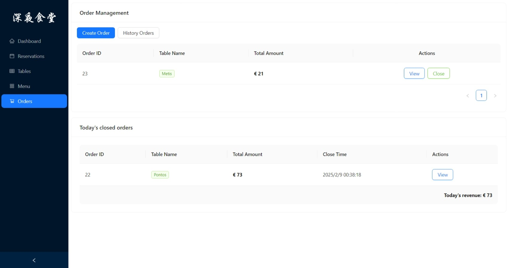

# Restaurant Management System Frontend

[](./LICENSE)

A **React + Ant Design**-based restaurant management system frontend project, designed for restaurant managers to comprehensively manage tables, reservations, menu items, orders, and view data insights.

## Project Overview

This project serves as the frontend of a restaurant management system, offering features such as:

- **Table Management**: View and edit table layouts and table statuses.
- **Reservation Management**: Manage reservations, including creating, confirming, and canceling reservations.
- **Menu Management**: Add, edit, and delete menu items.
- **Order Management**: Create, modify, close orders, and check historical orders and daily revenue.
- **Data Visualization**: Display daily or monthly revenue trends through charts.

### Backend Project

The backend of this project is implemented using **Spring Boot**, and its source code repository is available at:

[https://github.com/GatsbyBytheSea/RestaurantWebBackend](https://github.com/GatsbyBytheSea/RestaurantWebBackend)

This README provides guidance on using the frontend. For backend-related documentation, please refer to the backend repository.

## Key Features

### Dashboard
- Displays daily reservations, order count, and daily revenue.
- Provides revenue trend visualization for the past month.

### Table Management
- Displays and manages the table layout (grid-based UI).
- Allows adding, deleting, and editing table information (position, capacity, name, etc.).

### Reservation Management
- Create, edit, and cancel reservations.
- Search reservations by name, phone number, and status.
- Assign available tables when confirming a reservation.

### Menu Management
- View menu item list.
- Add, edit, and delete menu items.
- Provide statistics and visualizations (e.g., category-based statistics).

### Order Management
- Create new orders and add items to orders.
- Modify, delete, and close orders.
- View closed orders, daily revenue, and historical revenue.

### User Login
- Administrators must log in to access management features.

## Tech Stack

- **Language**: JavaScript
- **Framework**: React
- **UI Components**: Ant Design
- **Data Visualization**: @antv/g2plot (for basic charts)
- **Routing**: React Router
- **Network Requests**: Fetch / Axios
- **Build Tool**: Vite

## Project Structure

Below is the main directory structure of the project:

```
restaurant-management-frontend
├── public
├── src
│   ├── api                      // API calls to interact with the backend
│   │   ├── ordersAPi.js
│   │   ├── reservationsAPi.js
│   │   ├── tablesAPi.js
│   │   ├── dishesAPi.js
│   │   └── ...
│   ├── components               // Reusable components
│   │   ├── dish
│   │   │   ├── DishVisualization.jsx
│   │   │   ├── AddDishModal.jsx
│   │   │   └── EditDishModal.jsx
│   │   ├── order
│   │   │   ├── OrderDetailModal.jsx
│   │   │   ├── CloseOrderModal.jsx
│   │   │   ├── AddDishPanel.jsx
│   │   │   └── ...
│   │   ├── reservation
│   │   │   ├── CreateReservationModal.jsx
│   │   │   └── EditReservationModal.jsx
│   │   ├── table
│   │   │   ├── TableVisualization.jsx
│   │   │   ├── TableFormModal.jsx
│   │   │   └── ...
│   │   └── ...
│   ├── pages                    // Page-level components
│   │   ├── Dashboard.jsx
│   │   ├── DishManagement.jsx
│   │   ├── Orders.jsx
│   │   ├── Reservations.jsx
│   │   ├── Tables.jsx
│   │   └── ...
│   ├── App.js                   // Root component
│   ├── index.js                 // Entry file, renders root component
│   └── ...
├── index.html                   // HTML template
├── package.json
├── README.md
└── ...
```

## Installation & Usage

Ensure that you have **Node.js (version 14+)** and npm or yarn installed on your local machine.

### Clone the Repository

```bash
git clone https://github.com/GatsbyBytheSea/restaurant-management-frontend.git
cd restaurant-management-frontend
```

### Install Dependencies

```bash
# If using npm
npm install

# If using yarn
yarn
```

### Run in Development Mode

```bash
# Using npm
npm start

# Or using yarn
yarn start
```

By default, the project runs at [http://localhost:5173](http://localhost:5173). To change the port or backend API address, modify the `.env` file or update the scripts in `package.json`.

### Build for Production

```bash
# npm
npm run build

# yarn
yarn build
```

After building, a `build` folder will be generated for deployment.

## Screenshots

- **Login Page**  
  

- **Dashboard**  
  

- **Reservation Management**  
  

- **Menu Management**  
    
  

- **Order Management**  
    
    
    
  

- **Table Management**  
    
  

## License

This project is licensed under the [MIT License](./LICENSE).
Copyright (c) 2025 [**Xinlei ZHU**](https://github.com/GatsbyBytheSea)

---

> **Copyright &copy; 2025 [Xinlei ZHU](https://github.com/GatsbyBytheSea).**
> Licensed under the MIT License.